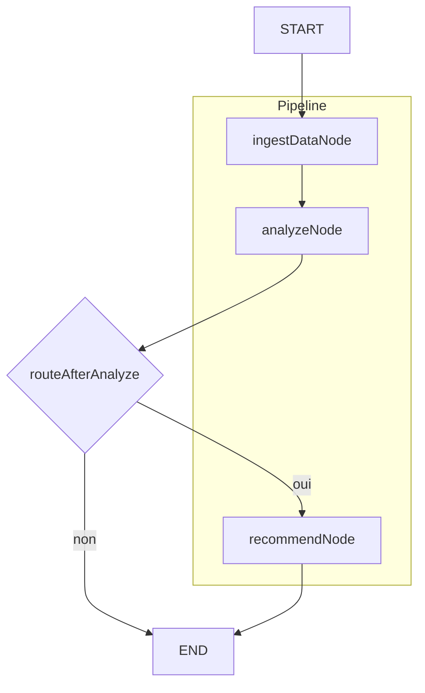

# Optimisation de l’Infrastructure Technique pour Jean (CTO)

## Objectif

Développer une solution qui permet de :

### 1. Ingestion et Analyse de Données Techniques

- Traiter des données simulées issues d’un fichier JSON ou d’un flux en temps réel.

### 2. Détection d’Anomalies

- Identifier des indicateurs anormaux (par exemple : utilisation excessive du CPU, latence élevée, etc.).

### 3. Génération de Recommandations

- Produire un rapport structuré (format JSON ou affichage console) proposant des actions concrètes pour optimiser la performance de l’infrastructure (répartition de charge, ajustement des ressources, etc.).

## Architecture Multi-Noeuds

Votre solution doit être organisée en plusieurs étapes (par exemple : ingestion →
analyse → recommandation). La structuration de ces étapes est laissée à votre
discrétion.

## Documentation

Expliquez vos choix techniques et architecturaux (langage, bibliothèques, etc.) via
des commentaires dans le code ou un document annexe.

---

## Principe

- Extraction des données (ex. toutes les 30 min depuis un fichier JSON ou flux).
- Ingestion d’un extract par le node `ingestDataNode`, analyse par `analyzeNode`, puis recommandations dans `recommendNode` si anomalies.

Petit graph mermaid pour expliquer brièvement les nodes:



- **ingestDataNode** : lit le dernier message, parse le rapport JSON et l’ajoute à l’historique des rapports (limité à 10 pour limiter le context / la mémoire).
- **analyzeNode** : détecte les anomalies (métriques au-dessus des seuils dans `constants.ts`, services offline).
- **routeAfterAnalyze**: Il y a une petite optimisation si il n'y a pas de metrics au dessus des seuils. On skip **recommendNode**.
- **recommendNode** : reçoit les derniers rapports et les anomalies, appelle le LLM et renvoie une liste structurée de recommandations au format :

Exemple de retour:

```json
{
  "recommendations": [
    {
      "priority": "high",
      "action": "Augmenter les ressources CPU de 20% ou activer l'autoscaling",
      "related_metrics": ["cpu_usage", "latency_ms"],
      "estimated_impact": "Réduction de la latence de ~30%"
    }
  ]
}
```
